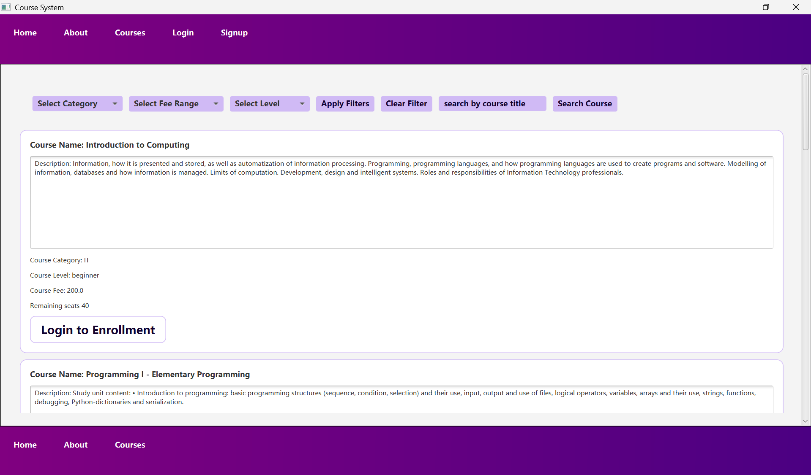
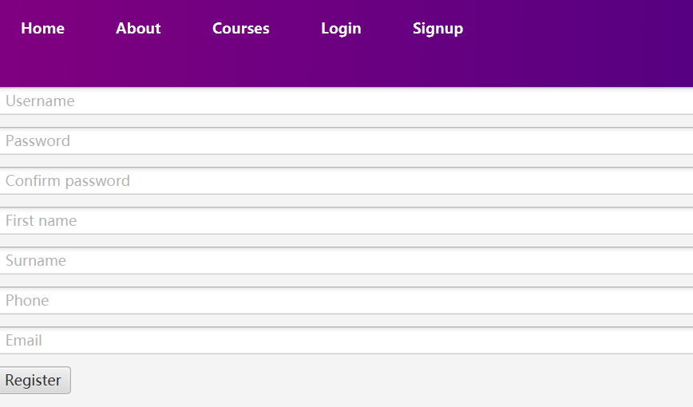
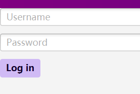
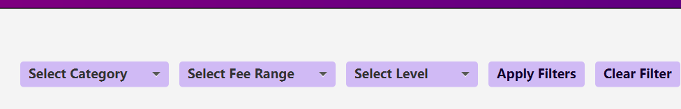
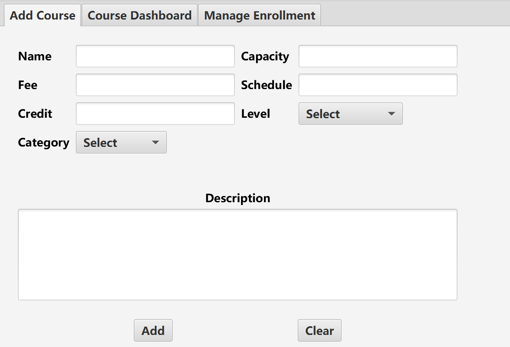
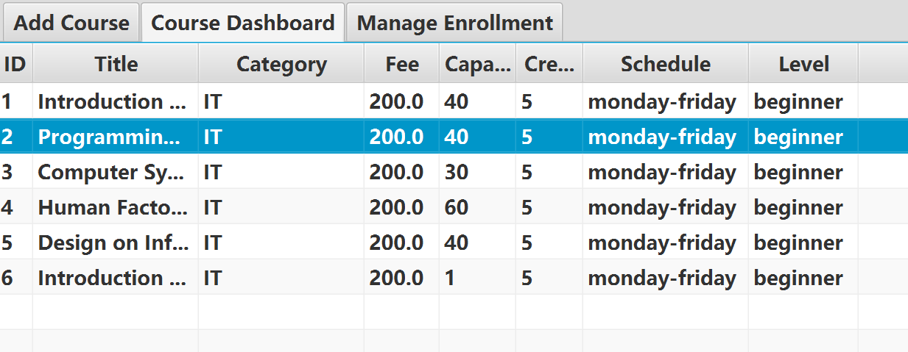
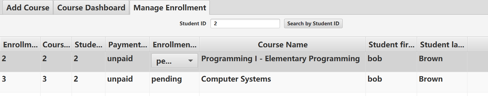

<div align="center">  
  <h1>Course Management System</h1>  
  <p>  
    A JavaFX desktop application for managing university course enrollments and student registrations.  
  </p>  
</div>  

# Table of Contents
- [About the Project](#about-the-project)
  * [Tech Stack](#tech-stack)
  * [Features](#features)
- [Getting Started](#getting-started)
  * [1. Prerequisites](#1-prerequisites)
  * [2. Installation & Setup](#2-installation--setup)
  * [3. Run Locally](#3-run-locally)
- [Usage](#usage)
  * [Student View (User Role)](#student-view-user-role)
  * [Admin Dashboard (Staff Role)](#admin-dashboard-staff-role)
  * [Important Notes regarding the MVP Release](#important-notes-regarding-the-mvp-release)
- [Roadmap](#roadmap)
- [Team Members](#team-members)
## About the Project

This project is a Minimum Viable Product (MVP) desktop application designed for university course management. It has a classic Three-Tier Architecture, which separates the UI, Business Logic, and Database. It allows students to browse courses and securely enroll, while providing staff with an administrative dashboard to manage the course catalog and registration records.

### Tech Stack

<details>  
  <summary>Application & UI</summary>  
  <ul>  
    <li><a href="https://www.oracle.com/java/">Java SE</a></li>  
    <li><a href="https://openjfx.io/">JavaFX</a></li>  
  </ul>  
</details>  

<details>  
<summary>Database & Connectivity</summary>  
  <ul>  
    <li><a href="https://www.mysql.com/">MySQL</a></li>  
    <li><a href="https://docs.oracle.com/javase/8/docs/technotes/guides/jdbc/">JDBC (java.sql)</a></li>  
  </ul>  
</details>  

### Features

- **Role-Based Access Control (RBAC):** Distinct interfaces and privileges for `admin` (staff) and `user` (students).
- **Course Catalog Management:** Admins can dynamically add, edit, and delete courses.
- **Advanced Search & Filtering:** Students can quickly find courses using a title-based search or narrow down their options by category, difficulty level, and price range.
- **Concurrency Handling:** Pessimistic database locking prevents over-allocation of course seats during simultaneous enrollment attempts.
- **Enrollment Tracking:** Admins can search for specific student registrations and update payment/enrollment statuses.


## Getting Started

Follow these instructions to set up your local development environment and run the application.

### 1. Prerequisites

Before you begin, ensure you have the following installed on your local machine:

* **Java JDK 17 or higher:** This project utilizes the Java Module System. It is highly recommended to use an LTS version (e.g., JDK 11, 17, or 21). You can download it from [Oracle JDK](https://www.oracle.com/java/technologies/downloads/) or [Adoptium (OpenJDK)](https://adoptium.net/). Verify your installation by running `java -version` in your terminal.
* **MySQL Server 8.0+:** Ensure the database server is installed and running on port `3306`. Download from [suspicious link removed].
* **IDE:** An IDE that supports Java modules and JavaFX (e.g., IntelliJ IDEA).


### 2. Installation & Setup

#### **Step 1: Clone the Repository**

Open your terminal and run the following commands to download the code:

```bash  
git clone https://github.com/lala4111/Software-Engineering.git  
```  
  
---  

#### **Step 2: Initialize the Database**

To run this project, you need to create the local MySQL database with the initial tables and sample data.

1. Open your preferred MySQL client (e.g., MySQL Workbench).
2. Execute the following SQL script:

```sql  
DROP DATABASE IF EXISTS course_system;  
CREATE DATABASE course_system;  
USE course_system;  
CREATE TABLE person (  
                        id INT UNSIGNED AUTO_INCREMENT PRIMARY KEY,                        username VARCHAR(25) UNIQUE NOT NULL,  
                        password VARCHAR(25) NOT NULL,  
                        firstName VARCHAR(25) NOT NULL,  
                        surName VARCHAR(50) NOT NULL,  
                        phone VARCHAR(9),  
                        email VARCHAR(25) NOT NULL,  
                        role ENUM('user', 'admin') NOT NULL);  
CREATE TABLE course (  
                        id INT UNSIGNED AUTO_INCREMENT PRIMARY KEY,                        title VARCHAR(100) NOT NULL,  
                        description VARCHAR(1000) NOT NULL,  
                        seat INT UNSIGNED,                        fee DECIMAL,  
                        schedule VARCHAR(100),  
                        level ENUM('beginner', 'intermediate', 'advanced'),                        category VARCHAR(50),  
                        credits FLOAT UNSIGNED NOT NULL);  
  
CREATE TABLE enrollment (  
                            enrollmentId INT UNSIGNED AUTO_INCREMENT PRIMARY KEY,                            id_student INT UNSIGNED NOT NULL,                            id_course INT UNSIGNED NOT NULL,                            payment_status ENUM('unpaid', 'paid'),                            enrollment_status ENUM('pending', 'enrolled', 'completed', 'dropped'),                            FOREIGN KEY (id_student) REFERENCES person(id),  
                            FOREIGN KEY (id_course) REFERENCES course(id)  
);  
INSERT INTO course(title ,seat, description, fee, schedule, level,category,credits ) values ("Introduction to Computing", 40, "Information, how it is presented and stored, as well as automatization of information processing. Programming, programming languages, and how programming languages are used to create programs and software. Modelling of information, databases and how information is managed. Limits of computation. Development, design and intelligent systems. Roles and responsibilities of Information Technology professionals.",200.0, "monday-friday", "beginner" ,"IT",5);  
INSERT INTO course(title, seat, description,fee, schedule, level,category,credits) values ("Programming I - Elementary Programming", 40, "Study unit content: • Introduction to programming: basic programming structures (sequence, condition, selection) and their use, input, output and use of files, logical operators, variables, arrays and their use, strings, functions, debugging, Python-dictionaries and serialization.",200.0, "monday-friday", "beginner" ,"IT",5);  
INSERT INTO course(title, seat, description,fee, schedule, level,category,credits) values("Computer Systems",30, "Basics of computer systems; components, responsibilities and tasks of central processing unit, computer memory and memory management, principles and functionality of operating systems; end user devices; basics and structure of IT-infrastructure. The course includes a self-learning component based on topics that extend the content covered during the course.",200.0, "monday-friday", "beginner" ,"IT",5);  
INSERT INTO course(title, seat, description,fee, schedule, level,category,credits) values("Human Factors of Interactive Technology", 60, "Introduction to human-computer interaction and user-centred design methods. Basic concepts, methods, and devices for interaction. Usability and user experience. Interaction devices and different types of user interfaces. Design principles for user interfaces. Design and evaluation principles of graphical user interfaces",200.0, "monday-friday", "beginner" ,"IT",5);  
INSERT INTO course(title, seat, description,fee, schedule, level,category,credits) values("Design on Information Systems", 40, "Study unit content: • Definition of an information system and dimensions of the information system • Software production and production process • The process concept and characteristics of an process • Key concepts of information system design: information system, project, data, information, operational system, business system, information system quality • Information system lifecycle and lifecycle phases • Information system requirements and different types of requirements • Gathering requirements and requirements gathering techniques • Structured analysis and structured design, SA/SD (ER diagram, data flow diagram, data directory) • UML notation in information system modeling (structural and behavioral diagrams)",200.0, "monday-friday", "beginner" ,"IT",5);  
INSERT INTO course(title ,seat, description, fee, schedule, level,category,credits ) values ("Introduction to Computing", 1, "Information, how it is presented and stored, as well as automatization of information processing. Programming, programming languages, and how programming languages are used to create programs and software. Modelling of information, databases and how information is managed. Limits of computation. Development, design and intelligent systems. Roles and responsibilities of Information Technology professionals.",200.0, "monday-friday", "beginner" ,"IT",5);  
  
INSERT INTO person(username, password,firstName,surName,email, role) VALUES (  'Alice','alice123', 'alice','Brown','alicen@gmail.com','admin');  
INSERT INTO person(username, password, firstName,surName,email, role) VALUES ( 'Bob','bob123','bob','Brown','bob@gmail.com','user');  
select * from course;  
select * from enrollment;  
```  
  
---
#### **Step 3: Dependency Management (JDBC Setup)**
Because the project uses raw JDBC, you must manually add the MySQL driver to your classpath to allow Java to communicate with your database.
1. **Download:** Go to the [MySQL Connector/J Downloads](https://dev.mysql.com/downloads/connector/j/) page.
2. **Select:** Choose **Platform Independent** from the operating system dropdown, download the ZIP archive, and extract it.
3. **Configure in IDE (IntelliJ IDEA example):**
* Go to **File → Project Structure → Libraries**.
* Click the **+** (plus) icon, choose **Java**, and select the extracted `.jar` file (e.g., `mysql-connector-j-8.x.x.jar`).
* Click **OK** to apply.
--- 
#### **Step 4: Configure Database Credentials**
Before running the application, you must ensure the Java code points to your specific local MySQL setup.
1. Open `src/main/java/com.university/database/DBConnection.java` in your IDE.
2. Verify or edit the following variables:
* **`URL`**: Default is `"jdbc:mysql://localhost:3306/course_system"`. Change `3306` if your MySQL server runs on a different port.
* **`USER`**: Change this to your local MySQL username (e.g., `"root"`).
* **`PASSWORD`**: Change this to your local MySQL password

### 3. Run Locally
Once the database is initialized and the JDBC driver is linked, you are ready to run the application.

* **JavaFX Note:** Since Java 11, JavaFX is unbundled from the JDK. Ensure your IDE environment is configured to recognize the JavaFX modules defined in `module-info.java`.
* **Execute:** Compile and run the application via your IDE by executing the main class:  
  `com.university/ui/MainApp`
## Usage

This application provides distinct interfaces and capabilities based on the user's role (Student or Admin).

---

### Student View (User Role)

The **Home / Courses** page serves as the main dashboard for students. From here, students as users can browse the catalog, apply filters, search for specific classes, and enroll in courses.

#### 1. Account Registration

- Click **Sign Up** and fill in the required information.
- **Important:** Your `username` and `email` must be unique.
- After successful registration, the system will automatically log you in.
#### 2. Logging In

- Open the **Log In** tab.
- Authenticate using your registered `username` and `password`.
#### 3. Browsing & Filtering Courses

- **Filters:** You can narrow down the catalog using three dropdown filters: **Category**, **Fee Range**, and **Level**. You can apply any combination of these filters.
- Click the **Apply Filters** button to refresh the catalog based on your selections.
#### 4. Searching by Title

- To find a specific class, enter its name in the search bar.
- **Note:** The search requires an **exact match**, including capitalization (case-sensitive).
- Click **Search Course** to view the results.

#### 5. Enrolling in Courses

- Once logged in, browse the catalog and click the **Enroll** button located on any course card.
- The system will display an alert confirming a successful enrollment or indicating a failure (e.g., if you are already enrolled in that course or if the class is at capacity).
---

### Admin Dashboard (Staff Role)

Staff members have privileges to manage the course catalog and update student enrollment records.
- **Note:** When logged in as an Admin, the "Enroll" buttons on the Home/Courses page are hidden, and an **Admindashboard** button appears in the navigation header.
#### 1. Admin Access
- To log in as an administrator, use the default credentials provided in the database initialization script (e.g., Username: `Alice`).
- Alternatively, new Admin accounts can be manually inserted directly into the database.
#### 2. Tab: Add Course

- Fill in the course details in the provided form.
- **Validation Rules:**
  - `Fee` (Decimal/Double), `Credit` (Integer), and `Capacity` (Integer) must be valid numbers.
  - `Name`, `Fee`, `Credit`, `Capacity`, `Category`, and `Level` are mandatory fields.
  - `Schedule` and `Description` are optional during creation.
- Click **Add** to create the course. An alert will confirm "Successful creation."
- Click **Clear** to reset the form fields.
#### 3. Tab: Course Dashboard

- This tab displays a view of the entire catalog.
- **View Details:** Single-click on any course row to open its detail view.
- **Modify:** Update the necessary fields and click **Modify**. _(Note: If the existing description is blank, you must input a new description to save modifications successfully)._
- **Delete:** Click **Delete** to permanently remove the course from the catalog.
#### 4. Tab: Manage Enrollment

- This tab displays all student enrollment records automatically.
- **Search:** Enter a `Student ID` in the search bar to filter records for a specific student.
- **Update Statuses:** Administrators can modify the **Payment Status** and **Enrollment Status**.
  - _How to edit:_ **Double-click** directly on the status cell (not the column header) to open a dropdown menu and select the updated status.
---

### Important Notes regarding the MVP Release
1. Currently, the **Home** and **Courses** navigation buttons direct to the same primary page.
2. **Manage Enrollment as an admin:** 
   - If a student makes a new enrollment, it will not dynamically appear in the Admin dashboard if you simply log out as a student then log back in as an admin. You must **restart the application** to fetch the latest records from the database.
   - Once you search by a specific `Student ID`, you will need to **restart the application** to view the full list of all student enrollments again. There is currently no "clear filter" button for searching enrollment records by student ID.
## Roadmap

* [x] Implement core MVP functionality (Registration, Browsing, Enrollment).
* [x] Establish JDBC MySQL connection and schema.
* [x] Implement automated UI state synchronization (refreshing UI automatically upon database changes).
* [ ] Add data encryption (password hashing) for enhanced security.
* [ ] Student to have their own dashboard to see what course they have registered.
* [ ] Integrate secure online payment processing for course enrollments.
* [ ] Future migration to a Web-based interface.
## Team Members

Members are listed in alphabetical order by first name.
* **[Arnas Plunge]** - [GitHub Profile](https://github.com/Lifelord122)
* **[Enikő Tóth]** - [GitHub Profile](https://github.com/EnikoToth13)
* **[Gefei Meng]** - [GitHub Profile](https://github.com/heavyRainnn)
* **[Maryam Agaiby]** - [GitHub Profile](https://github.com/maryamagaiby)
* **[Rara Sekiguchi]** - [GitHub Profile](https://github.com/lala4111)